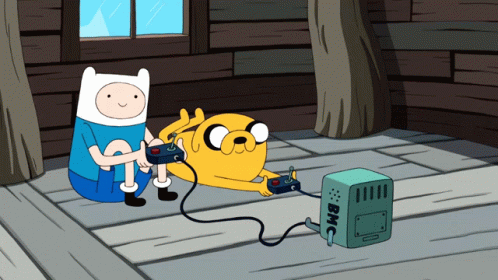

#   ESPAÑOL:

## <i align="center" style="font-size:2rem"> 🎮 MINI JUEGOS CON REACT</i>

En este proyecto se usaron hooks como **useState,useEffect** , tenologias como  **HTML,CSS,JavaScript,React,SASS** y para el manejo de rutas **React Router**.

 _Este proyecto fue construido con el proposito de practicar React_

**Nota: Es responsivo**

## 💡 Como se penso este proyecto y como funciona

**_Idea Principal: Hacer diferentes juegos_**

Primero que nada, en un primer momento desarrolle los juegos individualmente sin el proposito de juntarlos todos en una pagina , simplemente los realice separados y ya .

Al momento de terminar de desarrollar todos los juegos decidi que seria buena idea juntarlos a todos en una sola pagina así el usuario que quisiera jugar alguno de ellos puediera elegir con que juego divertirse

Como los desarrolle individualmente voy a explicar uno por uno su desarrollo:

### Simon Dice :

**_Idea Principal del juego: Cuatro rectangulos que sigan una secuencia y el usuario intente replicarla_**

Nota: Este proyecto ya lo habia realizado previamente con JS Vanilla por lo que tome como referencia ese proyecto para poder reconstruirlo pero en React

Lo primero que realice fue el tablero, que es el comoponente llamado **_"SimonSquare"_**, en un primer momento solamente eran secciones vacias/planas sin nada. Luego al estar un poco mas avanzado en la creacion del juego decidi cambiar un poco este componente y que acepte diferentes parametros. Principalmente un **ID**, este ID es importante por que al momento de comparar la jugada de la maquina y la jugada del ususario este ID coincide a su vez con la referencia de la seccion y de la jugada . A su vez tambien se le pasa por parametro su respectiva **Referencia** para poder identificarlo y estilizarlo , y la funcion que realiza la **jugada del usuario**.

Cree un hook personalizado que me permitia guardar la logica de la jugada de la maquina, otro que me permite guardar  la logica de la jugada del usuario , otro que me permite saber el turno  y por ultimo un hook que me permite saber si el juego termino o no.

### Juego de Memoria :

**_Idea Principal del juego:Diferentes rectangulos/cuadrados de diferentes colores , cuando el usuario toque un cuadrado se iluminara y cuando toque otro y sea igual se pondran en gris. Al completar todos los cuadrados ganara_**

Nota: Este proyecto ya lo habia realizado previamente con JS Vanilla por lo que tome como referencia ese proyecto para poder reconstruirlo pero en React

Lo primero que hice fue realizar el tablero de juego , para esto dentro del hook personalizado **_"UseColors"_** realice la logica referida a los colores como tal de los tableros. Primero se creo un estado en cual posee todos los colores , se randomizo sus posiciones y se renderizaron los diferentes cuadrados del tablero pasandole como propiedad a estos el **color** (el cual luego es su color de fondo )  y la funcion que realiza/evalua la **jugada del usuario**.

Ademas realice otros hooks personalizados entre ellos: Un hook que evalua los **tableros adivinados** para asi saber si el juego termino , otro que evalua el **final del juego** , otro que se encarga del **inicio del juego** (Modal),otro que se encarga de la logica de la **jugada del usuario** y otro que evalua los **turnos**.

### Ta-te-ti :

**_Idea Principal del juego:Un ta-te-ti de toda la vida . Donde el primero ue pueda colocar 3 mismas figuras en linea diagonal/horizontal/vertical gana el juego sino se empata_**

Lo primero que hice al igual que en los anteriores fue realizar el tablero de juego, esto lo hice principalmente gracias al hook personalizado **_"usePlays"_** que este posee el estado incial de las jugadas del tablero ,que en un primero momento esta vacio pero aun asi nos sirve para poder renderizar cada uno de los cuadrados del tablero. Ademas este hook evalua en cada jugada si hay un ganador o si todavia hay algun cuadrado vacio o no , para asi determinar el final del juego 

A estos cuadrados del tablero se les pasa por propiedad, una **posicion** que corresponde al index dentro del array de las jugadas del tablero, se le pasa la funcion que actualiza **el tablero/la jugada** que esta a su vez recibe por parametro la posicion del cuadrado y a su vez se le pasa la **jugada** para que sea mostrada en el tablero

Ademas de este hook personalizado hay otro mas que se encarga del manejo de turnos, y un estado general de la app que se encarga de saber si el juego termino/hay un ganador

----------------------------------------------------------------------------------------------------------

Al momento de tener todos los juegos cree un nuevo proyecto con VITE ,cree la pagina/vista HOME donde aqui estan las diferentes opciones para poder jugar . Y cree diferentes botones que cada uno posee el nombre del juego al que pertenecen .

Luego traje de los diferentes juegos sus componentes y estilos , y los adapte al nuevo proyecto . Les agregue a cada uno de ellos un boton de **Back** para volver al menu principal

Para los estilos utilice SASS ya que me parecio una herramienta bastante adecuada y eficiente para este proyecto.

--------------------------------------------------------------------------------------------
--------------------------------------------------------------------------------------------

#  ENGLISH:

## <i align="center" style="font-size:2rem"> 🏆 MINI-GAMES WITH REACT</i>

In this project was used hooks like **useState,useEffect** , technologies like **HTML,CSS,JavaScript,React,SASS** and for routes managment **React Router**

 _This project was built with the purpose to practising React_

**Note: It´s responsive**

## 🤔 How this project was thought and how it works 

**_Main Idea : Make different games_**

First of any, I developed all this games before to create the actual page, because i did not have the purpose to put together all of these , I just make them .

At the moment to develop all this games I decided that will be a good idea put together all these games in a single page for the user experience . Because if the user wants to play different games , he can do it and have fun.

As i developed each individually , I will explain them one by one.

### Simon Say :

**_Main Idea of the game: Four reactangles that follow a sequence and the user try to follow it_**

Note : This project I developed previously with Vanilla JavaScript so I toke a lot of notes as a reference for can build it with React.

The first one, I made was the board, which is formed with the component called **_"SimonSquare"_**.
At  first moment  these components were empty. Then when the project was more advanced, I decided change a little bit this component to  accept different parameters. Mainly ID, this ID is very important to compare the  plays of the machine with the plays of the player, this ID match with the reference of the section and the play, at the same time another parameter is  **Referency** to be able  to identify and style it ,and finally the function that performs the **play of the user**.

I made one custom hook that allowed me save all the user´s game logic , another than allowed me save all the machine´s game logic , another that allowed me to know the turn and finally another that allowed meto  know if the game was over or not.

### Memory Game :

**_Main Idea of the game: Different rectangles each  with different colors except for pairs,when user touch any of these , it will light up and when user touch another one if the two  are same they will turn grey background . When user complete all the rectangles the game will over_**

Note : This project I developed previously with Vanilla JavaScript so I toke a lot of notes as a reference for can build it with React.

The first that i made was realize the board of the game , for this into the custom hook **_"UseColors"_** , i realized the logic refered to the board´s colors.
Fist I make an state that has all the differents colors, was randomized the index of the colors and rendered the different squares of the board to pass it as  properties:  **color**(this will its background color) and function that  evaluates the **play of the user**.

Also i made other custom hooks among these: a hook that evaluates the **guessed squares** to know if the game is finished or not, another that evaluate the **end of the game**, another that can **start of the game**(Modal), another that contains the logic of **play of the user** and another that knows the **turns**.

### Tic-Tac-Toe :

**_Main Idea of the game :One Tic-Tac-Toe .Where the first one who can fit  three diagonal/horizontal/vertical same figures into the squares  wins the game if it is not  a tie _**

First thing that i did ,as  in the others games ,the game board . I made this  thanks to custom hook **_"usePlays"_** that contains the initial state of each of the moves of the board, that in a first moment are empty but it´s very useful because thanks to it can render each of the squares of the board.

To these squares of the board were pass it properties : a **position** that corresponds to the index into the array of the boards plays, another the function that update **board/play** at the same time it receives as parameter the square position and the **plays** to show it in screen.

Also apart of it there is other  custom hook that handle the turns , and a general state of the app  ,this state know if the game finished/ has a winner .

----------------------------------------------------------------------------------------------------------

At moment of have all the games , I created a new project with VITE , builted the page/screen HOME where here are the different options to can play. I created different buttons that each has the name of the game to which belong.

After ,I moved the different games´s componets and styles to this project and adapted they . I added to each one button of **back** to back to the main menu.

For the styles i used SASS because it´s a tool very efficient and i like it so much.

